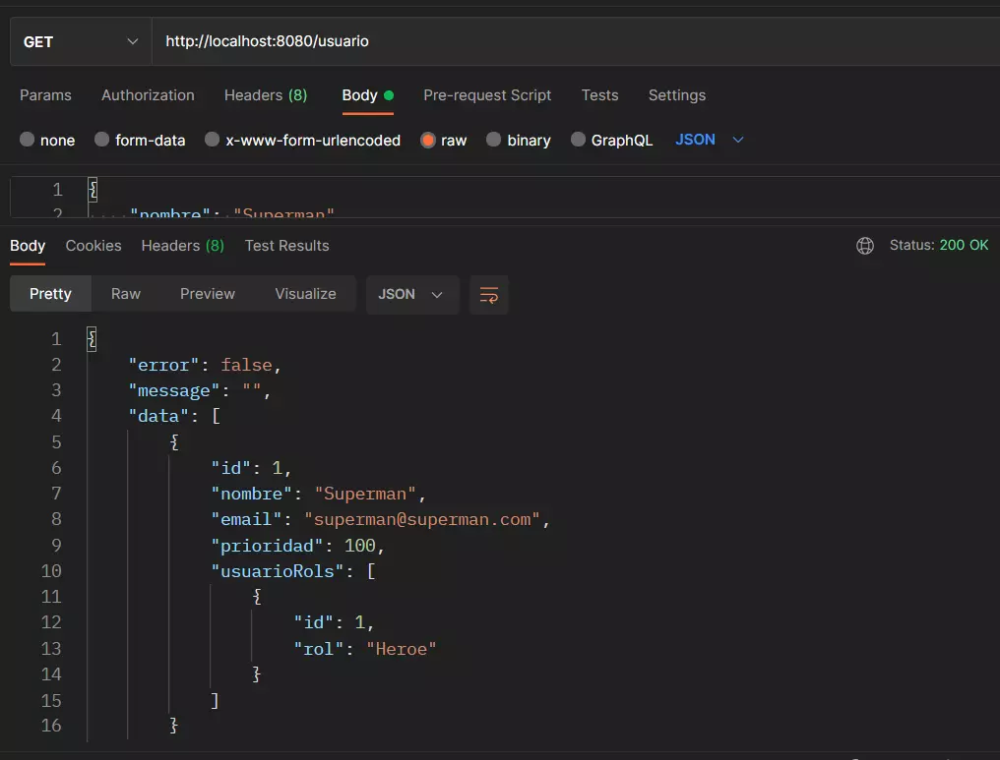
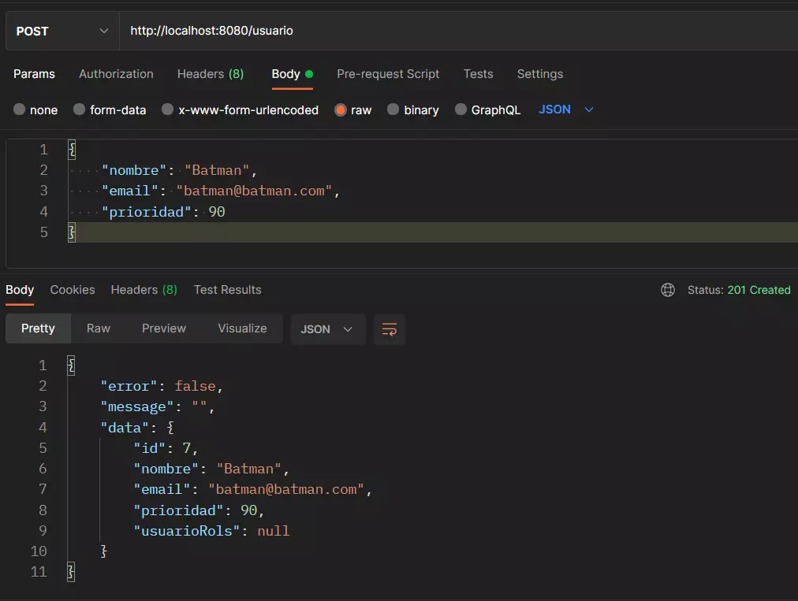
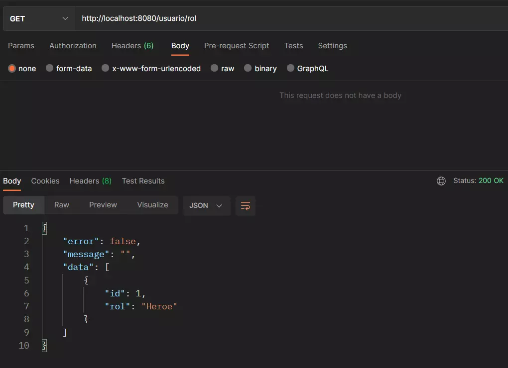
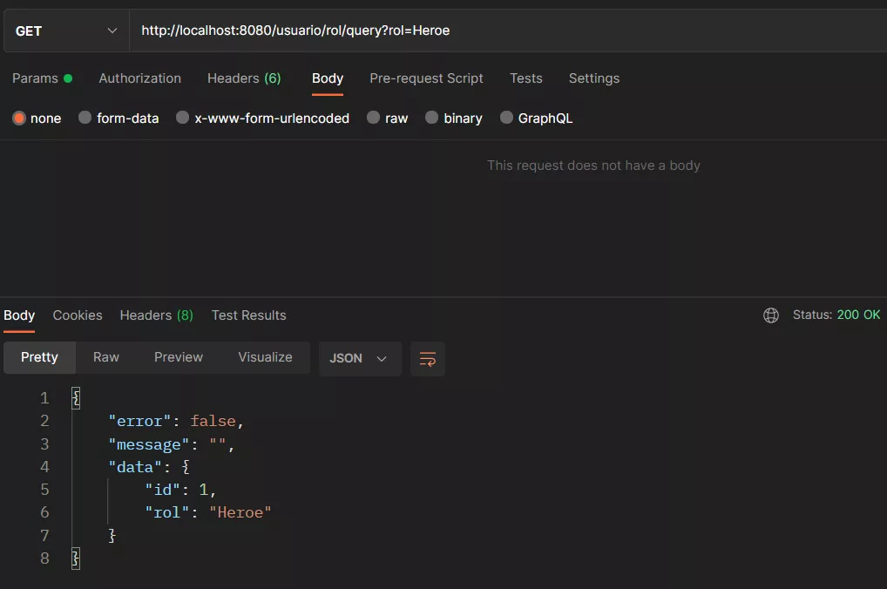
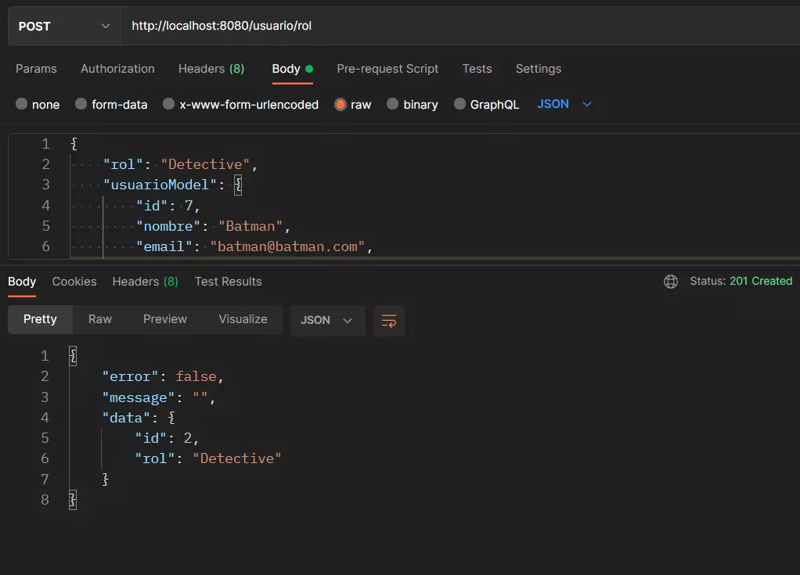

# Workshop SpringBoot and MySQL
    Spring Boot, JPA, MySQL, Unit testing

## Routes
    @Index
    localhost:8080/
    
    @GET
    /usuario
    /usuario/{id}
    /usuario/query?prioridad=?
    /usuario/rol
    /usuario/rol/{id}
    /usuario/rol/quey?rol=?

    @POST
    /usuario
    /usuario/rol
    
    @DELETE
    /usuario/{id}
    /usuario/rol/{id}

    @PUT
    /usuario/{id}
    /usuario/rol/{id}

## Why I chose @OneToMany
    I was following the instructions written in the Excel file
    and only ask for add one more entity, if you want to uses ManyToMany
    you need an intermediate table.

## Evidences
    @Get Usuario

    @Post Usuario

    @Get UsuarioRol

    @Get query UsuarioRol

    @Post UsuarioRol

    
